<details>
<summary> <b>Task 1:</b> The task requires an in-depth review of lab videos on C programming and the RISC-V architecture to develop a strong understanding of both subjects. After completing the review, the  C program is compiled using two different compilers: the GCC compiler and the RISC-V compiler. This exercise will demonstrate the understanding of the compilation process by allowing the user to compare how each compiler converts the C code into machine code. Through this comparison, identification of differences in the compilation process and the unique characteristics of each architecture can be done..</summary> 
<br>
Task is to refer to C based and RISCV based lab videos and execute the task of compiling the C code using gcc and riscv compiler.

**C Language based LAB**

**C and RISC-V Based Labs**

This repository showcases the steps involved in compiling C programs and generating assembly code using both a standard GCC compiler and a RISC-V GCC compiler. It provides detailed instructions and explanations to guide users through each phase of the compilation and debugging process.

**C Language-Based Lab**

Steps to Compile a .c File on a Local Machine:

1. Open the Bash terminal and navigate to the desired directory.
2. Use the following command to create and edit a new .c file:
   ```sh
   leafpad sum1ton.c


**Steps to Compile a .c File on our Machine:**
 ```sh
 gcc sum1ton.c
 ./a.out
```

 
Compilation and execution complete.
 
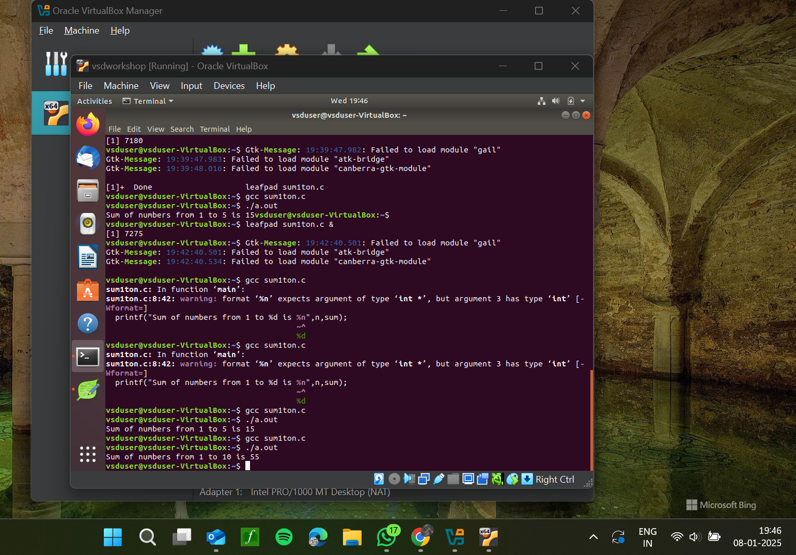
RISC-V Based Lab

**Steps to Compile Using RISC-V GCC Compiler:**
1. Ensure the RISC-V GCC compiler is installed and accessible on the system.
2. Verify the .c file contents using the cat command:
   ```sh
   cat sum1ton.c


3. Compile the C program for RISC-V architecture using 01 option:
 ```sh
riscv64-unknown-elf-gcc -o1 -mabi=lp64 -march=rv64i -o sum1ton.o sum1ton.c
```
4. Disassemble the object file to view its assembly code using:
 ```sh
riscv64-unknown-elf-objdump -d sum1ton.o
```
5. Minimize the assembly by using following code:
```sh
riscv64-unknown-elf-objdump -d sum1ton.o | less
```
   a)Extract the main function's assembly code by using:
   ```sh
/main
```
6. Use /main in the terminal to locate the main function in the assembly output.
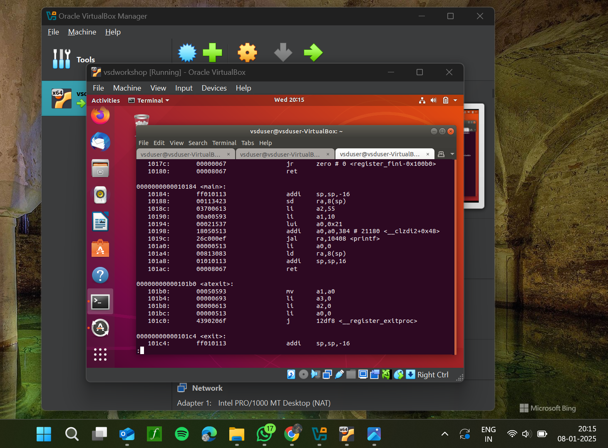

7.Compile the C program for RISC-V architecture using ofast option:
```sh
riscv64-unknown-elf-gcc -Ofast -mabi=lp64 -march=rv64i -o sum1ton.o sum1ton.c
```
8.Disassemble the object file to view its assembly code using:
```sh
riscv64-unknown-elf-objdump -d sum1ton.o
```
9.minimize the assembly by using following code:
```sh
riscv64-unknown-elf-objdump -d sum1ton.o | less
```
 a) Extract the assembly code **main** function using:
 ```sh
  /main
```
10. Use /main in the terminal to locate the main function in the assembly output.
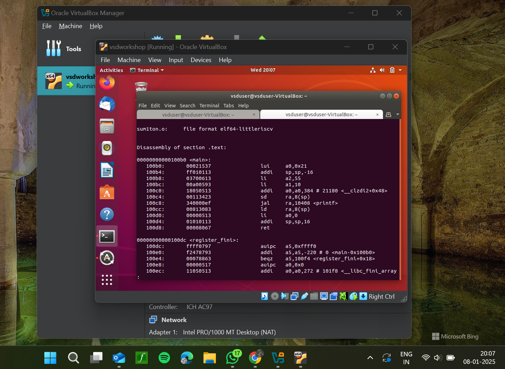

Explanation of Key Commands and Options: 
1. -mabi=lp64: Specifies the Application Binary Interface (ABI) for 64-bit integers, pointers, and long data types, tailored for the 64-bit RISC-V architecture.

2. -march=rv64i: Defines the 64-bit RISC-V base integer instruction set architecture.

3. -O1: Enables basic optimization to improve performance without significantly increasing compilation time.

4. -Ofast: Applies extensive optimizations for maximum speed improvements.

5. riscv64-unknown-elf-objdump: A disassembly tool for analyzing RISC-V binaries and debugging code efficiently.
 
   </details>


---

<details>
<summary> <b>Task 2:</b> This task requires an analysis of lab videos on both C programming and the RISC-V architecture to develop a thorough understanding of compiling C code for different architectures. After completing the review, the process of compiling C code must be carried out using two distinct tools: the GCC compiler and the RISC-V compiler simulator. This will demonstrate the ability to work with both compilers while providing insights into how each translates C code into machine-readable instructions specific to its respective architecture.</summary> 
<br>

Task is to analyze the SPIKE simulation performance using RISC-V GCC with -O1 and -Ofast optimization levels.  

*SPIKE Simulation and Compiler Optimization*

This repository showcases the process of compiling a C program with RISC-V GCC, running it in the SPIKE simulator, and analyzing performance differences between optimization levels (`-O1` and `-Ofast`). It provides detailed instructions and explanations to enhance understanding. 

**Steps to Complete the Task**  

1.Write a Simple C Program  

2.The following program calculates the sum of numbers from 1 to 100:  

3.Compile Using RISC-V GCC

4.Compile with -O1 Optimization.

*Use the following command to compile the program with the -O1 optimization flag:*
```sh
riscv64-unknown-elf-gcc -O1 -mabi=lp64 -march=rv64i -o sum1ton.o sum1ton.c
```
**Disassemble Object Files to View Assembly Code(in new terminal)**
*Generate Dump for -O1 Optimization*
```sh
riscv64-unknown-elf-objdump -d sum1ton.o
```
*Minimize the assembly by using following code:*
```sh
riscv64-unknown-elf-objdump -d sum1ton.o | less
```
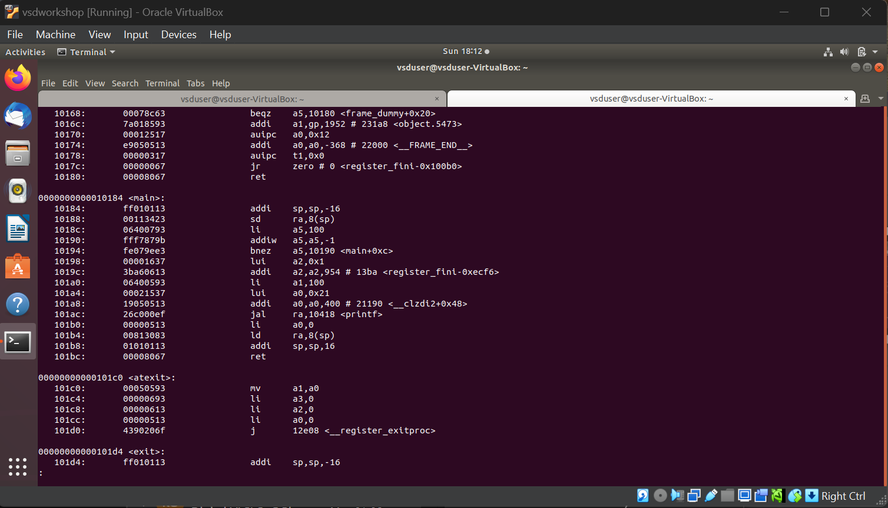


**Run SPIKE Simulation**
*Run a compiled RISC-V program on the SPIKE simulator in non-debug mode.*
```sh
spike pk sum1ton.o
```
*Invoke the debug mode of the SPIKE RISC-V simulator.*
```sh
spike -d pk sum1ton.o
```
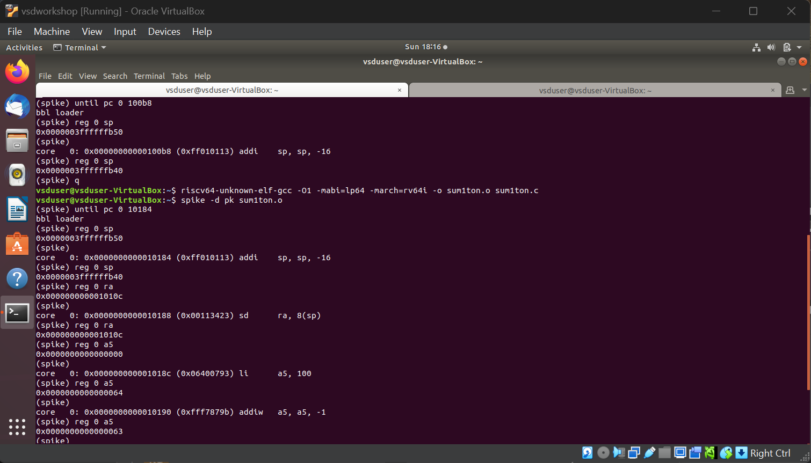


**Compile with -Ofast Optimization.**
*Use the following command to compile the program with the -Ofast optimization flag:*
```sh
riscv64-unknown-elf-gcc -Ofast -mabi=lp64 -march=rv64i -o sum1ton.o sum1ton.c
```
**Disassemble Object Files to View Assembly Code(in new terminal)**
*Generate Dump for -Ofast Optimization*
```sh
riscv64-unknown-elf-objdump -d sum1ton.o
```
*Minimize the assembly by using following code:*
```sh
riscv64-unknown-elf-objdump -d sum1ton.o | less
```
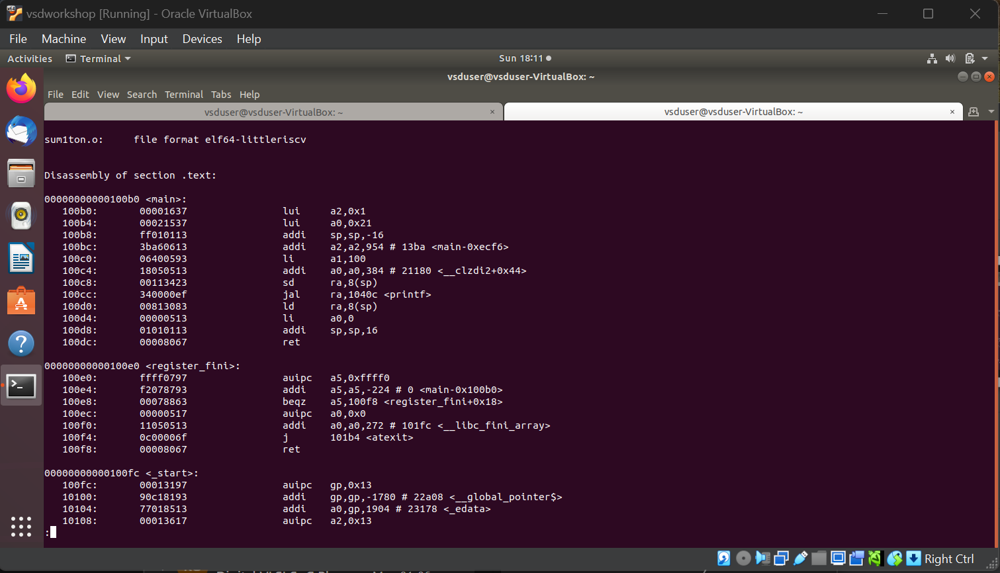


**Run SPIKE Simulation**
*Run -O1 Binary in SPIKE*
```sh
spike pk sum1ton.o
```
*Invoke the debug mode of the SPIKE RISC-V simulator*
```sh
spike -d pk sum1ton.o
```
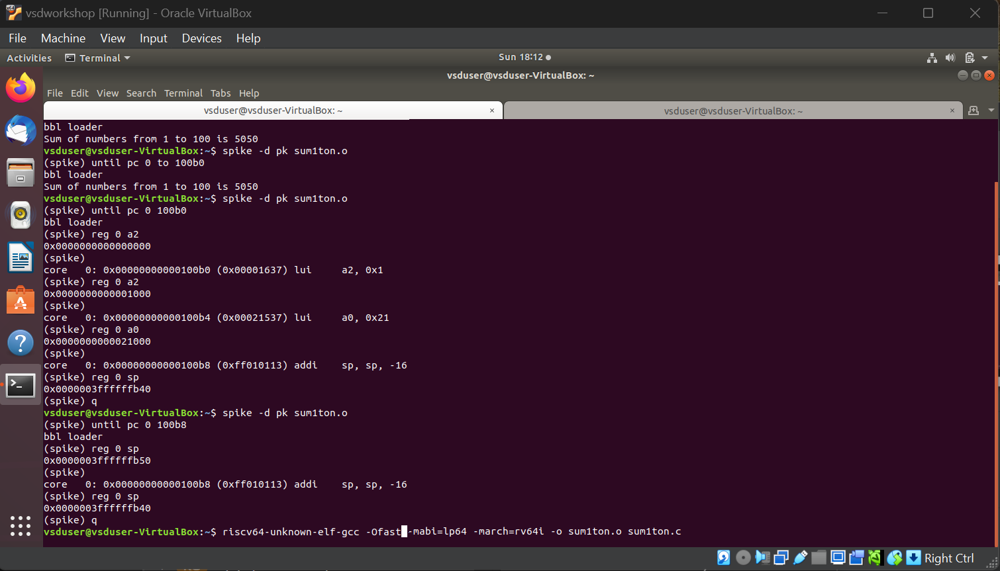


**After(spike -d pk swift.o) Observe the Instructions:**

1)After loading, SPIKE initializes and displays the Program Counter (PC) and Stack Pointer (SP).

2)Press Enter repeatedly to step through the execution.

3)Each press displays the next instruction executed by the program.

4)The displayed instructions directly correspond to the C code of the main program, providing insights into the program's execution flow.
**Explanation of Key Commands and Options:**

1. spike:RISC-V simulator that runs RISC-V programs on a virtual machine.

2. pk:Proxy kernel that acts as a minimal runtime environment for RISC-V programs, handling system calls like I/O and memory management.

3. sum1ton.o:The compiled RISC-V binary of your program (created using a RISC-V GCC compiler).

4. -d (for debugging):Debugging mode in SPIKE, allows stepping through the instructions and inspecting the program's behavior.

5. riscv64-unknown-elf-gcc:RISC-V GCC compiler used to compile the C program into a RISC-V object file (.o).

6. -O1, -Ofast: Compiler optimization flags:
      a.-O1: Basic optimizations for performance.
      b.-Ofast: Extensive optimizations for maximum speed.

7. riscv64-unknown-elf-objdump:Disassembles RISC-V binaries to examine assembly code.

These tools together enable compiling, running, and debugging RISC-V programs on a simulated environment.

</details>

---

<details>
<summary><b>Task 3:</b> The objective is to examine and classify each given instruction according to its type—whether it belongs to the R-type, I-type, or J-type category. After categorization, each instruction must be converted into its corresponding 32-bit machine code while adhering to the specific encoding format and opcode structure of the target architecture. The final output should present a comprehensive mapping of the instructions along with their correctly formatted binary representations.</summary>

This repository contains a list of 15 unique RISC-V instructions extracted from the assembly code along with their corresponding 32-bit instruction codes. These instructions cover different instruction formats, such as **U-type**, **I-type**, **J-type**, **B-type**, and **R-type**.


# RISC-V Instructions

This README contains a table of 15 unique RISC-V instructions, their machine codes, opcodes, formats, and instruction binaries for my assembly codes.

| Instruction                | Opcode  | Format | Machine Code | Instruction Binary                          |
|----------------------------|---------|--------|--------------|----------------------------------------------|
| lui a0, 0x21              | 0110111 | U-type | 0x00021537   | 00000000000000100001010100110111            |
| addi sp, sp, -16          | 0010011 | I-type | 0xff010113   | 11111111000000010000000000010011            |
| li a2, 720                | 0010011 | I-type | 0x2d000613   | 00000010110100000000011000010011            |
| addi a0, a0, 384          | 0010011 | I-type | 0x18050513   | 00000001100001010000010100010011            |
| sd ra, 8(sp)              | 0100011 | S-type | 0x00113423   | 00000000000100011010010000100011            |
| jal ra, 10408             | 1101111 | J-type | 0x340000ef   | 00000011010000000000000011101111            |
| ld ra, 8(sp)              | 0000011 | I-type | 0x00813083   | 00000000100000011000000010000011            |
| ret                       | 1100111 | I-type | 0x00008067   | 00000000000000001000000001100111            |
| auipc a5, 0xffff0         | 0010111 | U-type | 0xffff0797   | 11111111111111110000011110010111            |
| beqz a5, 100f4            | 1100011 | B-type | 0x00078863   | 00000000000001111000100001100011            |
| j 101b0                   | 1101111 | J-type | 0x0c00006f   | 00000011000000000000000001101111            |
| lw a0, 0(sp)              | 0000011 | I-type | 0x00012503   | 00000000000000010010010100000011            |
| srai s1, a5, 0x3          | 0110011 | R-type | 0x4037d493   | 01000000001101111010010010010011            |

         

</details>


---
<details>
<summary> <b>Task 4: </b>The task requires simulating a RISC-V Core using the given Verilog netlist and testbench. A simulation environment must be set up using tools such as Icarus Verilog and GTKWave. The simulation should be executed to verify the functional correctness of the core, and the output signals must be analyzed. Waveform snapshots of the executed instructions need to be captured and uploaded to a GitHub repository, accompanied by a brief description. This documentation should demonstrate an understanding of RISC-V functional simulation and verification.</summary> 
<br>

### Installing iverilog and gtkwave

- **For Ubuntu**

 Open your terminal and type the following to install iverilog and GTKWave
 ```
 $   sudo apt get update
 $   sudo apt get install iverilog gtkwave
 ```

- **To clone the repository and download the netlist files for simulation , enter the following commands in your terminal.**

 ```
 $ git clone https://github.com/vinayrayapati/iiitb_rv32i
 $ cd iiitb_rv32i
 ```
- **To simulate and run the verilog code , enter the following commands in your terminal.**

```
$ iverilog -o iiitb_rv32i iiitb_rv32i.v iiitb_rv32i_tb.v
$ ./iiitb_rv32i
```
- **To see the output waveform in gtkwave, enter the following commands in your terminal.**

`$ gtkwave iiitb_rv32i.vcd`

#### *Analysing the Output Waveform of various instructions*  

**```Instruction 1: ADD R6, R2, R1```** 
**Operation:** Adds `r2` and `r1`, and stores it in r6.
  
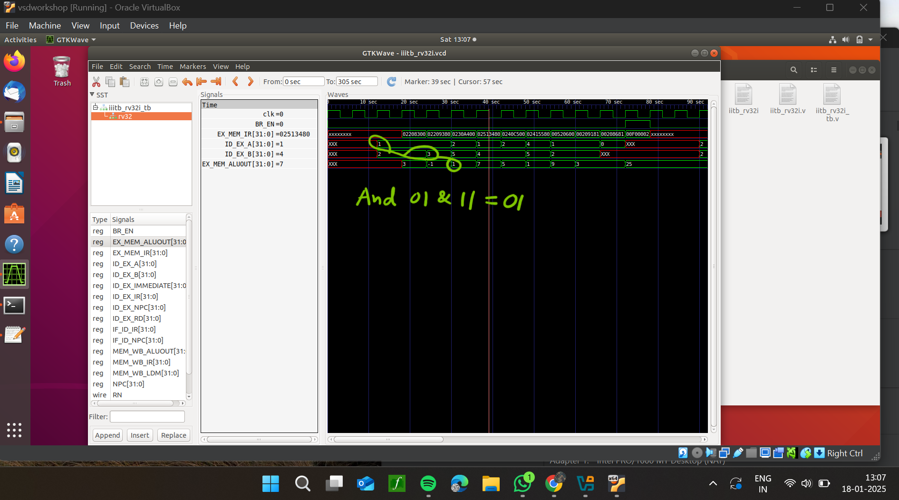


**```Instruction 2: SUB R7, R1, R2```**  
**Operation:** Subtracts `r2` from `r1`, and stores it in r7.
  
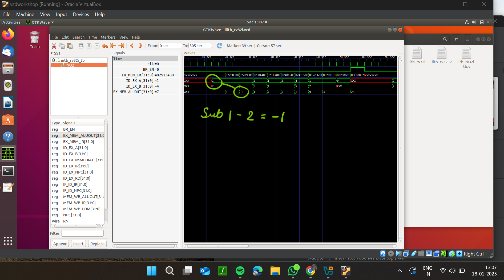


**```Instruction 3: AND R8, R1, R3```**  
**Operation:** And operation on `r2` and `r1`, and stores it in r8.


**```Instruction 4: OR R9, R2, R5```**  
**Operation:** Or operation on `r2` and `r1`, and stores it in r6.

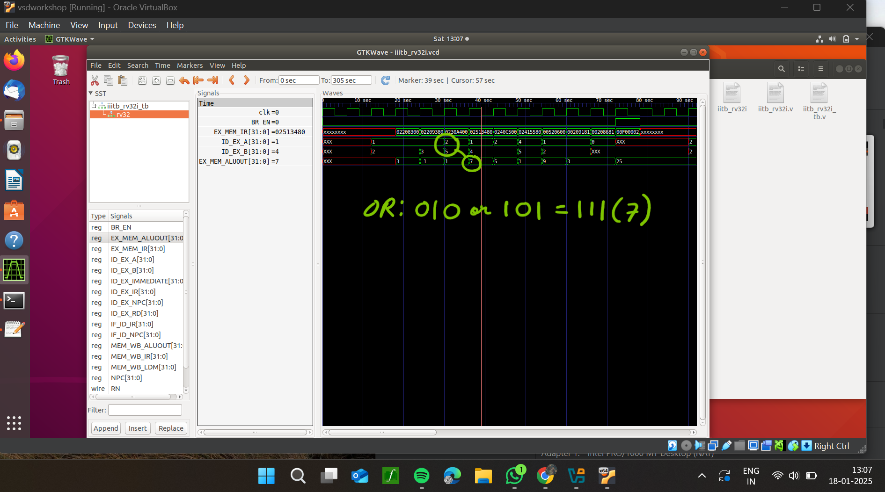


**```Instruction 5: XOR R10, R1, R4```**  
**Operation:** Xor operation on `r2` and `r1`, and stores it in r6.

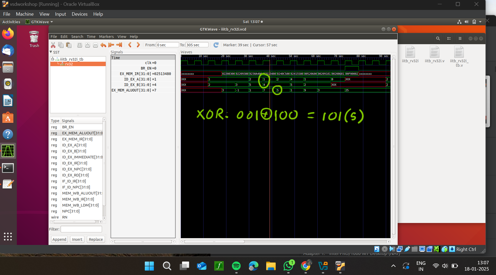


**```Instruction 6: SLT R1, R2, R4```** 
**Operation:** Compares two registers `r2` and r4` and sets the destination register `r1` to 1 if the first register is less than the second; otherwise, it sets the destination to 0.


**```Instruction 7: ADDI R12, R4, 5```**
**Operation:** Performs an addition operation between a register `r4` and an immediate (constant) value (5) and stores in `r12`.


**```Instruction 8: BEQ R0, R0, 15```**  
**Operation:** The processor unconditionally jumps to the instruction located 15 instructions ahead.
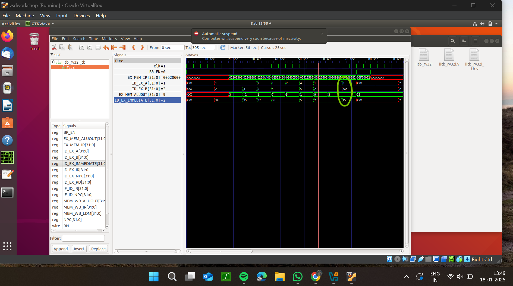

 
**```Instruction 9:sw r3,r1,2```**
**Operation:** stores the word in `r1` in another register `r3` with an offset of 2.
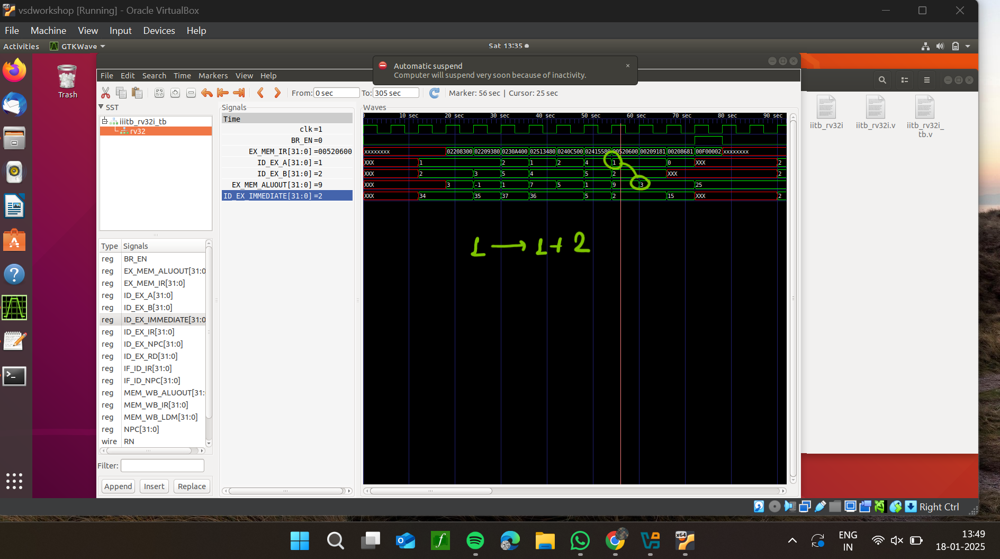

  
**```Instruction 10:lw r13,r1,2```**  
**Operation:** Loads word in `r1` in another register `r13` with an offset of 2.

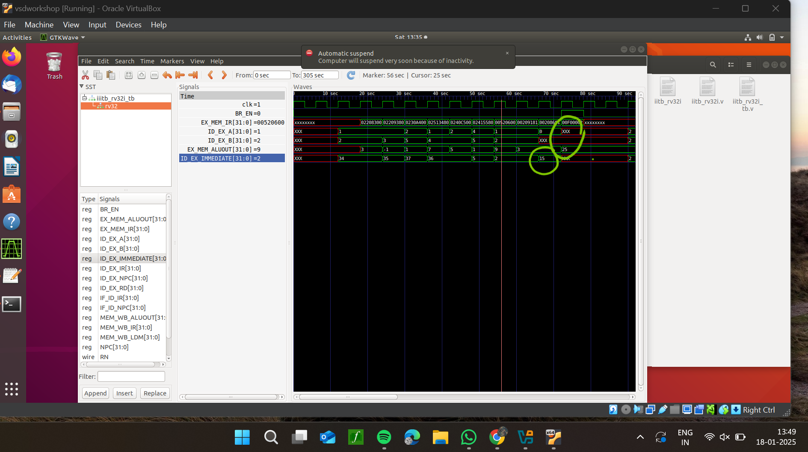

**``` Full Instruction description Waveform```**

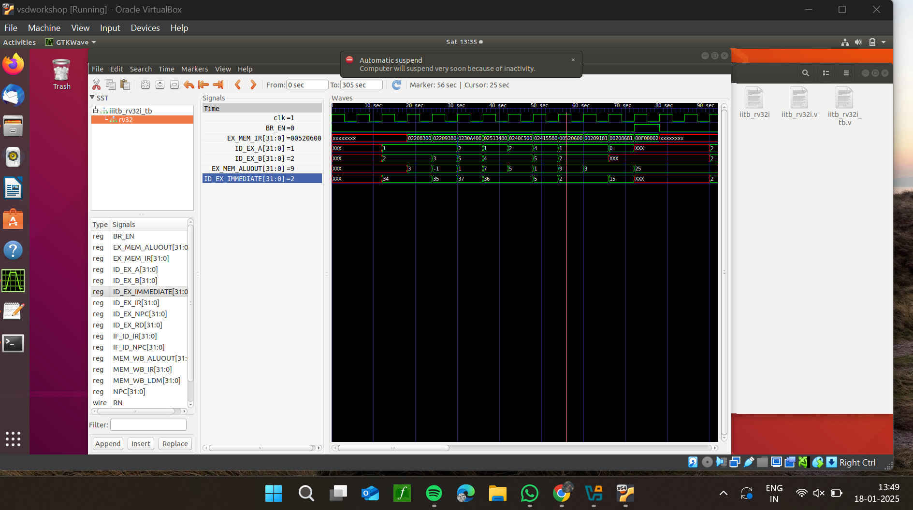


</details>

---

<details>
<summary> <b>Task 5:</b>This intelligent lighting system is designed to regulate illumination based on ambient daylight and motion detection. It incorporates an LDR sensor to assess the presence of daylight and an IR sensor to detect movement within its range. When daylight is present, the system automatically switches off the LED. In the absence of daylight, the LED operates at 50% brightness. Upon detecting motion, the IR sensor activates the LED at full brightness. This system is commonly implemented in smart street lighting to enhance energy efficiency and support smart city initiatives.</summary> 
<br>

# Automatic Light System using VSDSquadron Mini RISC-V Board

## Project Overview
An **Smart light system** is a setup designed to automatically control the lighting based on the presence or absence of daylight or motion within its detection range.
### Features:
1. **Smart Light Control**: Switches light ON or OFF based on daylight conditions  
2. **Motion Detected**: LED brightness increases to 100% from it's default 50%   
3. **Energy Conservation**: Saves energy on street lights    

---

## Required Components  
| Component | Quantity | Description |
|-----------|----------|-------------|
| **VSDSquadron Mini Board** | 1 | RISC-V SoC-based development board |
| **IR Sensor** | 1 | Detects motion based on infrared radiation |
| **LDR Sensor**| 1 | Detects daylight condition | 
| **LEDs** | 5 | Represents street light |
| **Breadboard** | 1 | For circuit connections |
| **USB Cable** | 1 | Power and programming |
| **Jumper Wires** | - | For making connections |

---

## Pin Connections  

| **Component** | **Board Pin** | **Purpose** |
|--------------|-------------|-------------|
| **VCC of IR Sensor** | **5V** | Power supply |
| **GND of IR/LDR Sensor** | **GND** | Ground connection |
| **OUT of IR Sensor** | **Pin 4** | Motion detection signal |
| **OUT of LDR Sensor**| **Pin 5**| Light detection signal|
| **LED** | **Pins 0-4** | Indicates motion detected |

---
## Working 
- The **LDR sensor** is placed where it can detect light within its range.
- The **IR sensor** is placed where it can detect motion within its range.
- It continuously monitors light for any changes caused by environmental changes.
- When the LDR gives a false signal, LEDs light up at 50%.
- When an individual enters the detection range, the IR sensor sends a signal to the microcontroller.
- Upon detecting motion, the system turns the LED brightness to 100% by using PWM signals.
  
</details>

---


<details>
<summary> <b>Task 6:</b>The Smart Street Light System uses the VSDSquadron Mini RISC-V Board, a LDR sensor, an IR sensor, and LEDs for daylight and motion-based lighting control. The LDR detects light and IR sensor detects movement, respectively switching the LED ON/OFF and regulating the brightness. If no motion is detected, the LEDs stay at 50% brightness. This system is ideal for smart street light, sustainable energy usage, smart city developement.</summary> 
<br>

## Project Implementation  

### Steps to Implement:  
1. **Hardware Setup:**  
   - Connect the **LDR and IR sensor** to the board's GPIO pins.  
   - Wire an **LEDs** to indicate motion detection.  
   - Use a **breadboard** for easy prototyping and secure connections.  

2. **Software Development:**  
   - Write the **C firmware** to read the IR sensor output.  
   - Configure the GPIO pins for input (LDR and IR sensor) and output (LEDs).  
   - Implement logic to **Switch LEDs on/off and increse/decrease brightness** upon detecting motion.  
   - Keep the LED **OFF** as long as light is detected.  
   - Turn the LED brightness **100%** when movement is present.  

3. **Compilation & Upload:**  
   - Compile the code using a **RISC-V compatible toolchain**.  
   - Flash the program onto the **VSDSquadron Mini Board**.  

4. **Testing & Debugging:**  
   - Test the system in different lighting conditions.  
   - Adjust sensor sensitivity if needed.   

### Expected Output:  
- If light is detected for a certain period, the LED automatically **turns OFF**. 
- If no light is detected for, the LED automatically **turns ON**.
- If no motion is detected, LEDs are at 50% brightness.
- If motion detected brightness is incresed to 100%  

This implementation ensures **automatic lighting control**, **indicate the proper process**, and **security enhancements** for various applications.
---

## Code Implementation  
```c
#include "debug.h"

#define LED_COUNT 5

// Define LED GPIO pins (PC0 - PC4)
#define LED1_PIN GPIO_Pin_0  // Brightest
#define LED2_PIN GPIO_Pin_1  
#define LED3_PIN GPIO_Pin_2  
#define LED4_PIN GPIO_Pin_3  
#define LED5_PIN GPIO_Pin_4  // Least bright

#define LDR_PIN GPIO_Pin_4  // LDR sensor on PD4
#define IR_SENSOR_PIN GPIO_Pin_5  // IR sensor on PD5

uint16_t brightness_levels[] = {100, 60, 30, 15, 5}; // Simulated PWM duty cycle

void GPIO_Config(void);
void Control_LED_Brightness(uint8_t duty);

int main(void)
{
    NVIC_PriorityGroupConfig(NVIC_PriorityGroup_1);
    SystemCoreClockUpdate();
    Delay_Init();
    GPIO_Config();

    while (1)
    {
        uint8_t ldr_state = GPIO_ReadInputDataBit(GPIOD, LDR_PIN);
        uint8_t ir_state = GPIO_ReadInputDataBit(GPIOD, IR_SENSOR_PIN);

        if (ldr_state == 0) // Dark condition
        {
            if (ir_state == 1) // IR sensor detects object (Active)
                Control_LED_Brightness(100); // Full brightness
            else
                Control_LED_Brightness(30); // Dim light
        }
        else
        {
            Control_LED_Brightness(0); // Light detected, LEDs OFF
        }
    }
}

void GPIO_Config(void)
{
    GPIO_InitTypeDef GPIO_InitStructure = {0};

    // Enable GPIO clocks
    RCC_APB2PeriphClockCmd(RCC_APB2Periph_GPIOC | RCC_APB2Periph_GPIOD, ENABLE);

    // Configure LDR and IR sensor as input (PD4, PD5)
    GPIO_InitStructure.GPIO_Pin = LDR_PIN | IR_SENSOR_PIN;
    GPIO_InitStructure.GPIO_Mode = GPIO_Mode_IPU;
    GPIO_Init(GPIOD, &GPIO_InitStructure);

    // Configure LED pins (PC0 - PC4) as output
    GPIO_InitStructure.GPIO_Pin = LED1_PIN | LED2_PIN | LED3_PIN | LED4_PIN | LED5_PIN;
    GPIO_InitStructure.GPIO_Mode = GPIO_Mode_Out_PP;
    GPIO_InitStructure.GPIO_Speed = GPIO_Speed_50MHz;
    GPIO_Init(GPIOC, &GPIO_InitStructure);
}

// Function to simulate PWM brightness control
void Control_LED_Brightness(uint8_t duty)
{
    uint16_t pwm_levels[LED_COUNT];

    // Scale brightness based on duty cycle
    for (int i = 0; i < LED_COUNT; i++)
    {
        pwm_levels[i] = (brightness_levels[i] * duty) / 100;
    }

    // Simulate PWM by toggling LEDs
    for (int t = 0; t < 100; t++)
    {
        GPIO_WriteBit(GPIOC, LED1_PIN, (t < pwm_levels[0]) ? Bit_SET : Bit_RESET);
        GPIO_WriteBit(GPIOC, LED2_PIN, (t < pwm_levels[1]) ? Bit_SET : Bit_RESET);
        GPIO_WriteBit(GPIOC, LED3_PIN, (t < pwm_levels[2]) ? Bit_SET : Bit_RESET);
        GPIO_WriteBit(GPIOC, LED4_PIN, (t < pwm_levels[3]) ? Bit_SET : Bit_RESET);
        GPIO_WriteBit(GPIOC, LED5_PIN, (t < pwm_levels[4]) ? Bit_SET : Bit_RESET);
        Delay_Ms(1);
    }
}

```
</details>
---
